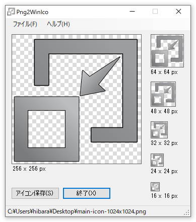

[English](README.md) / [日本語](README-JP.md)

# Png2WinIco

「Png2WinIco」 は、大きな PNG ファイルから、各サイズリソースを含む Windows 用 ICO ファイルを生成するアプリケーションです。

すでに存在している [png2ico](http://winterdrache.de/freeware/png2ico/) の生成する ICO ファイルよりも、より大きいサイズのリソースを含めることができ、GUI アプリケーションにしたものです。

「png2ico」は、Windows 7 から導入された、256pxサイズのアイコンには対応していないようです。256px以上のサイズのPNGを読み込ませようとすると、以下のようなエラーメッセージが表示されてしまいます。

```shell
Width must be multiple of 8 and <256. Height must be <256.
```

なにせ 2002/12/08 が最終更新です。今後更新も期待できないような気がします。

そこで、Windowsアイコンの定義に従ってアイコンを生成できるアプリケーションを開発しました。Microsoftの[公式ドキュメント](https://docs.microsoft.com/ja-jp/windows/win32/uxguide/vis-icons?redirectedfrom=MSDN#size-requirements)によれば、アイコンファイルのフルセットサイズは、`16x16`、`32x32`、`48x48`、`256x256` で、クラシックモードでは、これに `24x24`、`64x64` が含まれるようです。

ですので、このアプリケーションでは、以下のサイズのリソースが含まれるアイコンファイルを出力できます。

* 256x256
* 64x64
* 48x48
* 32x32
* 24x24
* 16x16

## 使い方

アプリケーションを起動して、PNG ファイルを開く（または、ドラッグ＆ドロップ）するだけです。



あとは、「保存」ボタンを押して ICO ファイルを指定した先へ保存してください。

なお、PNG ファイルは、幅・高さ共に 256px 以上を推奨します。リサイズしたときに、やや複雑な画像ですと、ICOファイルの各小さいサイズの質が粗くなる可能性があります。

## ダウンロード

[https://github.com/hibara/Png2WinIco/releases](https://github.com/hibara/Png2WinIco/releases)

## バージョン履歴

* v1.0.0.0 ( 2020/09/28 )
  * 初リリース

## Licence

MIT Licence

## サポート

要望、バグ報告、その他何かあればできるだけ、Issues に報告をお願いします。

ひばら　みつひろ  
[m@hibara.org](mailto:m@hibara.org)
